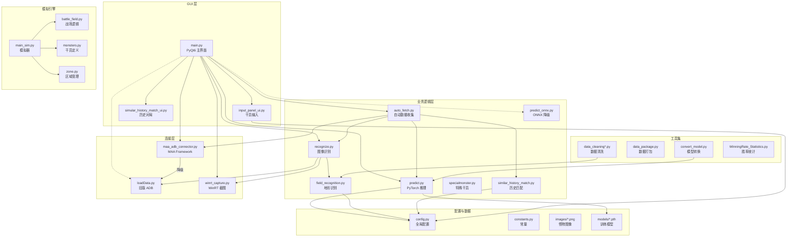

# CannotMax-Greenvine 项目结构分析

## 1. 项目目录树

```
CannotMax/
├── main.py                          # 主程序入口 (PyQt6 GUI)
├── main_sim.py                      # 独立战斗模拟器
├── main_old.py                      # 旧版主程序 (已废弃)
├── train.py                         # 模型训练
├── predict.py                       # PyTorch 预测
├── predict_onnx.py                  # ONNX 推理 (降级方案)
├── val.py                           # 模型验证
├── unit.py                          # 单元测试
├── 
├── recognize.py                     # 图像识别 (模板匹配 + OCR)
├── winrt_capture.py                 # WinRT 屏幕捕获
├── loadData.py                      # 旧版 ADB 连接 (legacy)
├── maa_adb_connector.py             # MAA Framework 适配器 (新版)
├── auto_fetch.py                    # 自动数据收集 (状态机)
├── specialmonster.py                # 特殊干员处理
├── find_monster_zone.py             # 怪物区域检测
├── field_recognition.py             # 地形特征识别
├── similar_history_match.py         # 历史对局匹配
├── simular_history_match_ui.py      # 历史对局面板 UI
├── input_panel_ui.py                # 干员输入面板 UI
├── data_package.py                  # 数据打包工具
├── config.py                        # 全局配置 (怪物数据)
├── constants.py                     # 常量定义
├── dark_mode_style_fix.py           # 暗色模式样式修复
├── login.py                         # 登录管理器
├── multi_instance.py                # 多实例支持
├── sim_mc.py                        # 蒙特卡洛模拟
├── WinningRate_Statistics.py        # 胜率统计
│
├── simulator/                       # 战斗模拟引擎
│   ├── __init__.py
│   ├── battle_field.py              # 战场逻辑
│   ├── monsters.py                  # 干员定义
│   ├── zone.py                      # 区域管理
│   ├── vector2d.py                  # 2D 向量
│   ├── projectiles.py               # 投射物
│   ├── elemental.py                 # 元素效果
│   ├── simulate.py                  # 模拟核心
│   ├── stats.py                     # 战斗统计
│   └── utils.py                     # 工具函数
│
├── tools/                           # 工具集
│   ├── package.py                   # 打包工具
│   ├── data_washer_new.py           # 数据清洗 (新版)
│   ├── data_nanWriter.py            # NaN 数据写入
│   ├── data_cleaning.py             # 基础清洗
│   ├── data_cleaning_with_field_recognize.py    # 带地形识别清洗 (CPU)
│   ├── data_cleaning_with_field_recognize_gpu.py # 带地形识别清洗 (GPU)
│   ├── HumanDataCheck.py            # 人工数据校验
│   ├── convert_model.py             # 模型转换 (PyTorch→ONNX)
│   └── battlefield_composite/
│       ├── battlefield_composite.py # 战场合成
│       └── extract_webm_frames.py   # WebM 帧提取
│
├── data_train/                      # 训练数据
│   └── 数据合并.py                  # 数据合并脚本
│
├── images/                          # 图像资源
├── models/                          # 训练模型
├── config/                          # 配置文件
│   └── maa_option.json              # MAA Framework 配置
│
└── platform-tools/                  # ADB 工具
```

## 2. 源代码文件列表

### 核心模块 (Core)
- **main.py** - PyQt6 主界面，集成识别、预测、历史匹配
- **auto_fetch.py** - 自动化数据收集，状态机管理战斗流程
- **recognize.py** - 图像识别核心，支持 ADB/PC/WIN 三种模式
- **predict.py** - PyTorch 模型推理，支持 CUDA/MPS/XPU/CPU
- **config.py** - 全局配置，加载怪物数据和图像

### 连接层 (Connectivity)
- **maa_adb_connector.py** - MAA Framework 适配器，支持多模拟器
- **loadData.py** - 旧版 ADB 连接，作为降级方案
- **winrt_capture.py** - WinRT 屏幕捕获，窗口选择器

### 战斗模拟 (Simulation)
- **main_sim.py** - 独立模拟器入口
- **simulator/battle_field.py** - 战场逻辑
- **simulator/monsters.py** - 干员定义和属性
- **simulator/simulate.py** - 模拟引擎

### 数据处理 (Data)
- **data_package.py** - 数据打包
- **tools/data_cleaning*.py** - 系列数据清洗脚本
- **similar_history_match.py** - 历史对局相似度匹配

### UI 组件 (UI)
- **input_panel_ui.py** - 干员输入面板
- **simular_history_match_ui.py** - 历史对局面板

## 3. 第三方库列表

### 核心依赖
| 库名 | 版本要求 | 用途 |
|------|---------|------|
| PyQt6 | - | GUI 框架 |
| opencv-python | - | 图像处理，模板匹配 |
| numpy | - | 数值计算 |
| pandas | - | 数据处理 |
| rapidocr | - | OCR 文字识别 |
| onnxruntime | - | ONNX 推理引擎 |
| torch/torchvision | >=2.7.0 | 深度学习 (可选 cu128/cpu) |
| scikit-learn | - | 机器学习工具 |
| matplotlib | - | 数据可视化 |
| pillow | - | 图像操作 |
| windows-capture | - | WinRT 屏幕捕获 |
| pywin32 | >=311 | Windows API |
| maafw | >=5.10.2 | MAA Framework |
| toml | - | 配置文件解析 |

### 开发依赖
| 库名 | 版本要求 | 用途 |
|------|---------|------|
| onnx | >=1.19.0 | ONNX 工具 |
| onnxscript | >=0.7.0 | ONNX 脚本 |
| pyinstaller | >=6.15.0 | 打包工具 |

## 4. 实现的功能

### 1. 多模式画面捕获
- **ADB 模式**: 通过 MAA Framework 连接雷电/MuMu/蓝叠等模拟器
- **PC 模式**: 连接明日方舟官方 PC 客户端
- **WIN 模式**: WinRT 高性能窗口/屏幕截取，支持直播画面

### 2. 深度学习预测
- **PyTorch 模型**: UnitAwareTransformer 架构，支持地形特征
- **ONNX 降级**: 当 PyTorch 不可用时自动切换
- **GPU 加速**: 支持 CUDA 12.8、Apple MPS、Intel XPU

### 3. 战斗模拟
- **独立引擎**: `simulator/` 目录包含完整战斗模拟
- **蒙特卡洛**: `sim_mc.py` 支持概率模拟
- **战场合成**: `battlefield_composite/` 生成可视化战场

### 4. 自动化流程
- **自动数据收集**: `auto_fetch.py` 状态机自动打本→截图→识别→预测
- **历史匹配**: 与历史对局相似度匹配
- **数据清洗**: 多种清洗策略，支持地形识别

### 5. 图像识别
- **模板匹配**: 6 个怪物区域头像识别
- **OCR**: RapidOCR 识别干员数量
- **地形识别**: `field_recognition.py` 识别地形特征

### 6. 特殊功能
- **特殊干员**: `specialmonster.py` 处理特殊干员逻辑
- **多实例**: `multi_instance.py` 支持多开数据收集
- **暗色模式**: `dark_mode_style_fix.py` 修复系统暗色模式

## 5. 依赖关系图



### 依赖说明

1. **主流程**: `main.py` → `recognize.py` (图像识别) → `predict.py` (预测) → UI 展示
2. **降级链**: `predict.py` (PyTorch) → `predict_onnx.py` (ONNX) → 错误提示
3. **连接链**: `maa_adb_connector.py` (MAA Framework) → `loadData.py` (自有 ADB)
4. **数据流**: `auto_fetch.py` → `recognize.py` → `predict.py` → `data_package.py`
5. **模拟流**: `main.py` → `main_sim.py` → `simulator/` 战斗引擎

## 6. 代码质量建议

### 当前问题
1. **重复代码**: `data_cleaning.py`、`data_cleaning_with_field_recognize.py`、`data_cleaning_with_field_recognize_gpu.py` 存在逻辑重复
2. **硬编码**: `recognize.py` 中的相对坐标硬编码，分辨率依赖强
3. **耦合度高**: `main.py` 导入过多模块，职责过重
4. **命名混乱**: `simular_history_match` 应为 `similar` (拼写错误)
5. **遗留代码**: `main_old.py`、`loadData.py` 仍保留但未完全废弃

### 重构建议
1. **统一数据清洗**: 合并三个数据清洗文件为配置化版本
2. **配置外部化**: 将 `recognize.py` 坐标提取到 JSON 配置
3. **分层架构**: 分离 UI 和业务逻辑，引入中间件
4. **命名修正**: 修正 `simular` → `similar` 拼写错误
5. **清理旧代码**: 移除或归档 `main_old.py`
